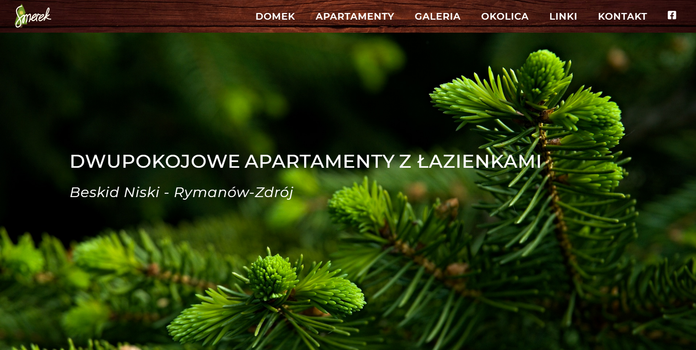
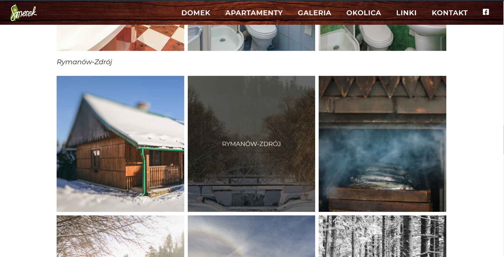
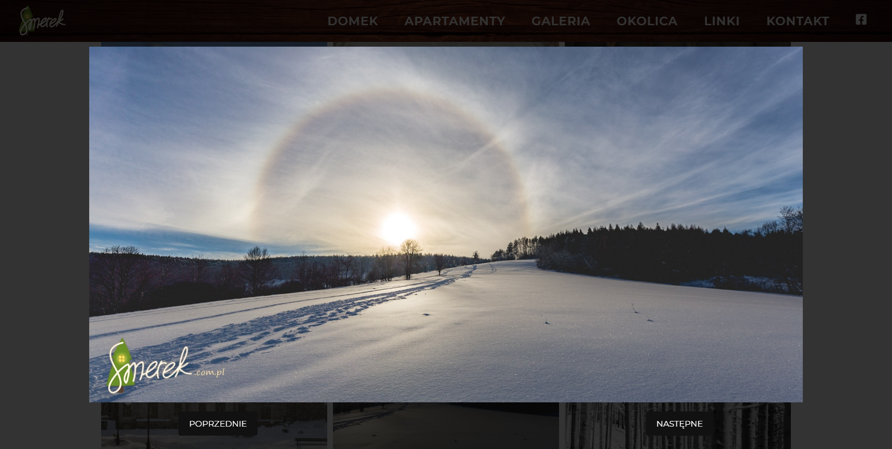
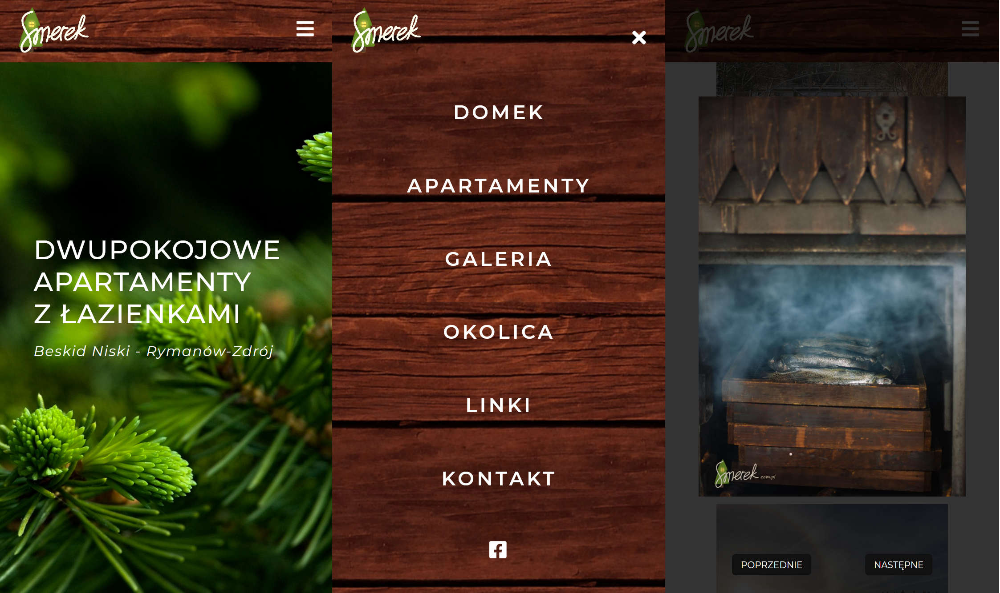

# Smerek.com.pl

http://www.smerek.com.pl

## General info

Website design presenting apartments for rent in the Lower Beskids. This is my first independent project made in such
technologies as HTML5, CSS3 and JavaScript. Thanks to this project I am able to write HTML fluently. I found out which tags should
be used in a given situation. I learned the style hierarchy in CSS. I tried to master flex and grid to arrange page
elements. I tried to create a responsive website that would clearly present the content.

## Technologies

Project is created with:

- HTML5
- CSS3
- JavaScript (ES6)

## Screenshots

## Licence

[MIT](https://choosealicense.com/licenses/mit/)
